---
# Front matter
title: "Математические основы защиты информации и информационной безопасности."
subtitle: "Лабораторная работа №2."
author: "Подмогильный Иван Александрович."

# Generic otions
lang: ru-RU
toc-title: "Содержание"

# Bibliography

# Pdf output format
toc: true # Table of contents
toc_depth: 2
lof: true # List of figures
lot: true # List of tables
fontsize: 12pt
linestretch: 1.5
papersize: a4
documentclass: scrreprt
## I18n
polyglossia-lang:
  name: russian
  options:
  - spelling=modern
  - babelshorthands=true
polyglossia-otherlangs:
  name: english
### Fonts
mainfont: PT Serif
romanfont: PT Serif
sansfont: PT Sans
monofont: PT Mono
mainfontoptions: Ligatures=TeX
romanfontoptions: Ligatures=TeX
sansfontoptions: Ligatures=TeX,Scale=MatchLowercase
monofontoptions: Scale=MatchLowercase,Scale=0.9
## Biblatex
biblatex: true
biblio-style: "gost-numeric"
biblatexoptions:
  - parentracker=true
  - backend=biber
  - hyperref=auto
  - language=auto
  - autolang=other*
  - citestyle=gost-numeric
## Misc options
indent: true
header-includes:
  - \linepenalty=10 # the penalty added to the badness of each line within a paragraph (no associated penalty node) Increasing the value makes tex try to have fewer lines in the paragraph.
  - \interlinepenalty=0 # value of the penalty (node) added after each line of a paragraph.
  - \hyphenpenalty=50 # the penalty for line breaking at an automatically inserted hyphen
  - \exhyphenpenalty=50 # the penalty for line breaking at an explicit hyphen
  - \binoppenalty=700 # the penalty for breaking a line at a binary operator
  - \relpenalty=500 # the penalty for breaking a line at a relation
  - \clubpenalty=150 # extra penalty for breaking after first line of a paragraph
  - \widowpenalty=150 # extra penalty for breaking before last line of a paragraph
  - \displaywidowpenalty=50 # extra penalty for breaking before last line before a display math
  - \brokenpenalty=100 # extra penalty for page breaking after a hyphenated line
  - \predisplaypenalty=10000 # penalty for breaking before a display
  - \postdisplaypenalty=0 # penalty for breaking after a display
  - \floatingpenalty = 20000 # penalty for splitting an insertion (can only be split footnote in standard LaTeX)
  - \raggedbottom # or \flushbottom
  - \usepackage{float} # keep figures where there are in the text
  - \floatplacement{figure}{H} # keep figures where there are in the text
---

# Цель работы

Освоить на практике шифрование Маршрутным шифрованием, шифрованием с помощью решеток и таблицей Виженера.

# Задание

1. Реализовать шифрование Маршрутным шифрованием
2. Реализовать шифрование шифрованием с помощью решеток
3. Реализовать шифрование с помощью таблицы Виженера

# Выполнение лабораторной работы

Написал код для зашивровки кодов Маршрутным шифрованием

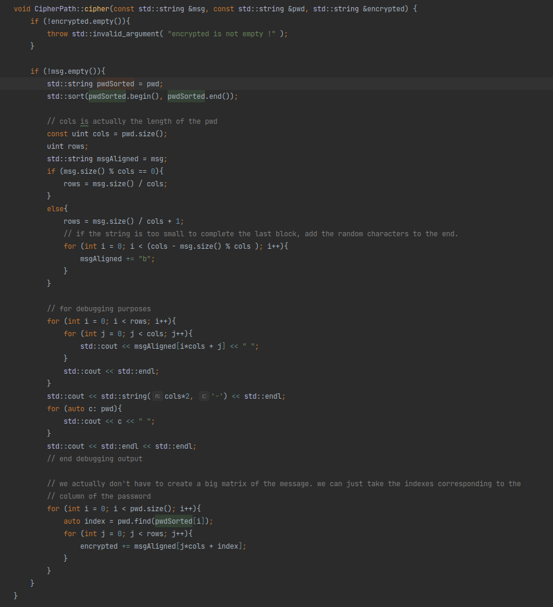{ #fig:001 width=70% }

Написал код для дешивровки кодов Маршрутным шифрованием

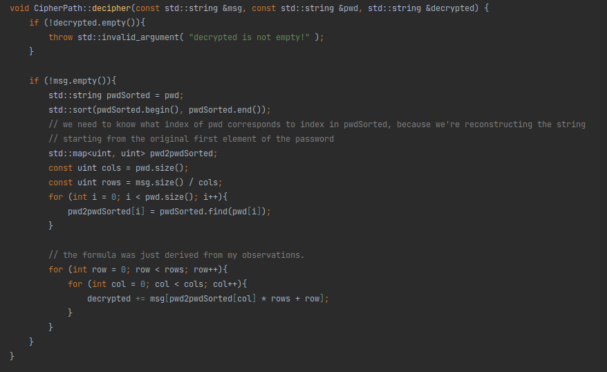{ #fig:002 width=70% }

Написал код для зашивровки кодов с помощью решеточного шифрования

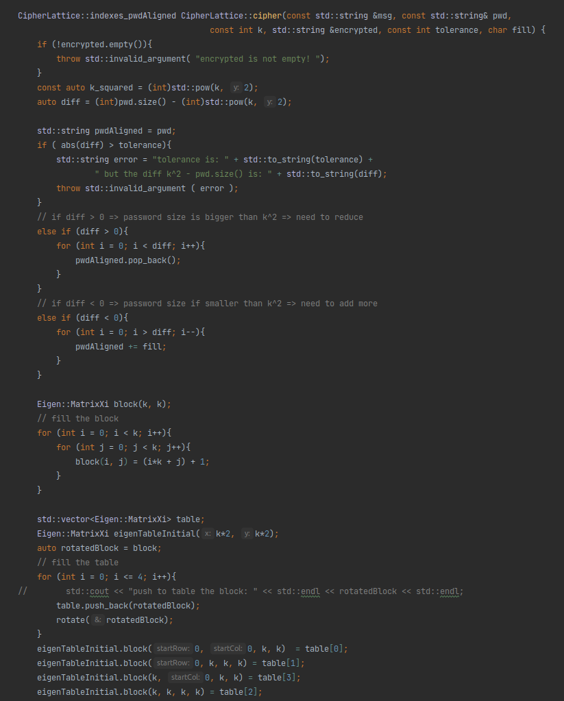{ #fig:003 width=70% }

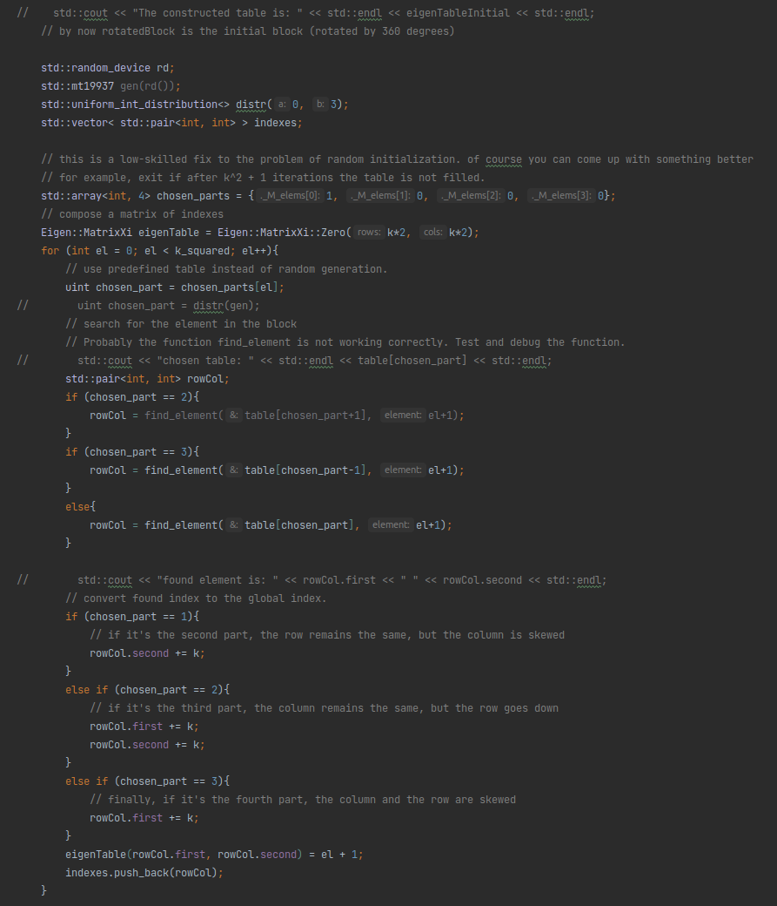{ #fig:004 width=70% }

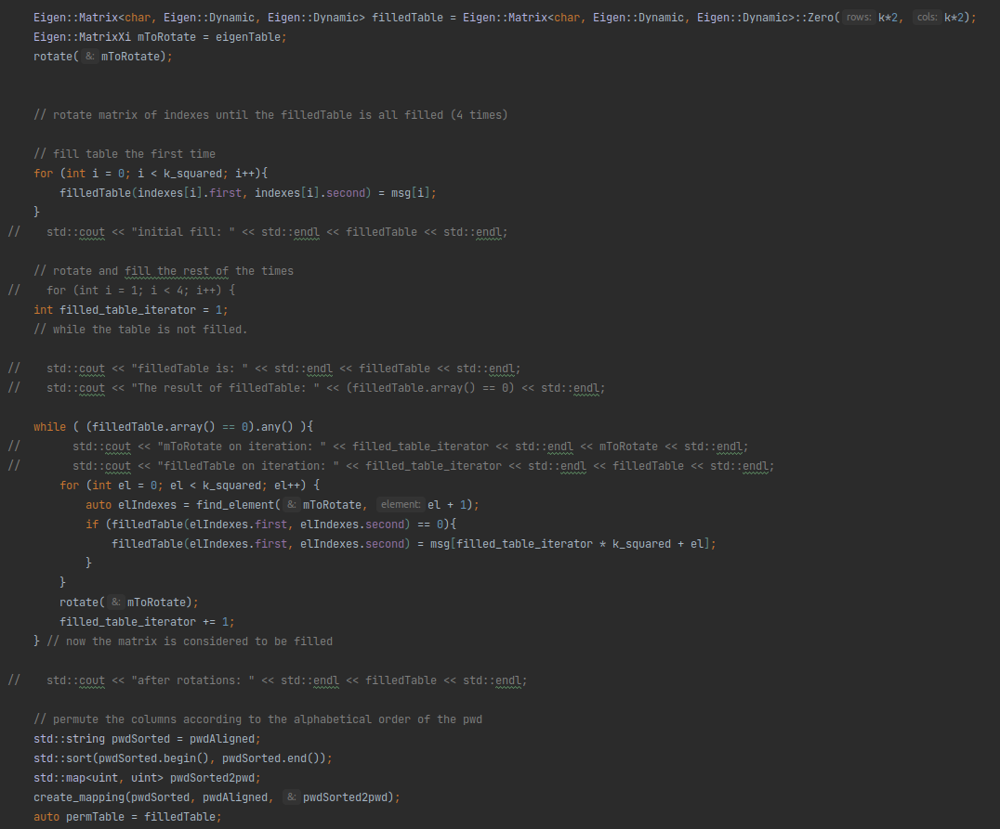{ #fig:005 width=70% }

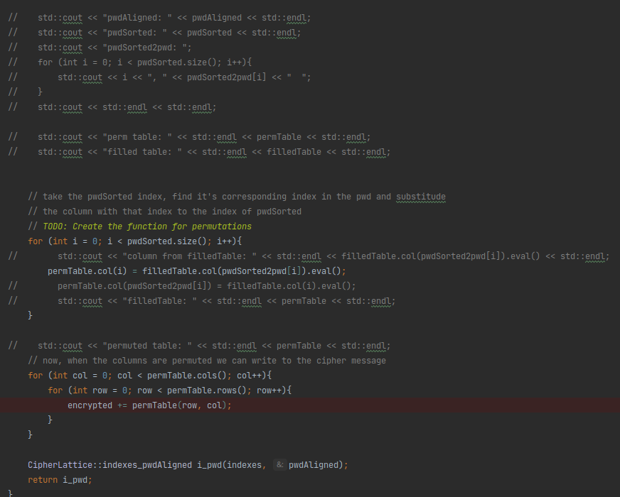{ #fig:006 width=70% }

Написал код для зашивровки кодов с помощью таблицы Виженера

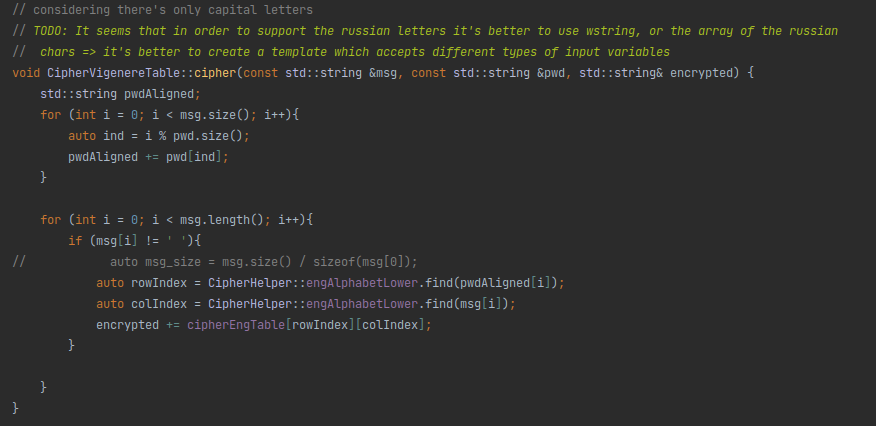{ #fig:007 width=70% }

Написал заголовочный файл для класса реализации CipherHelper2

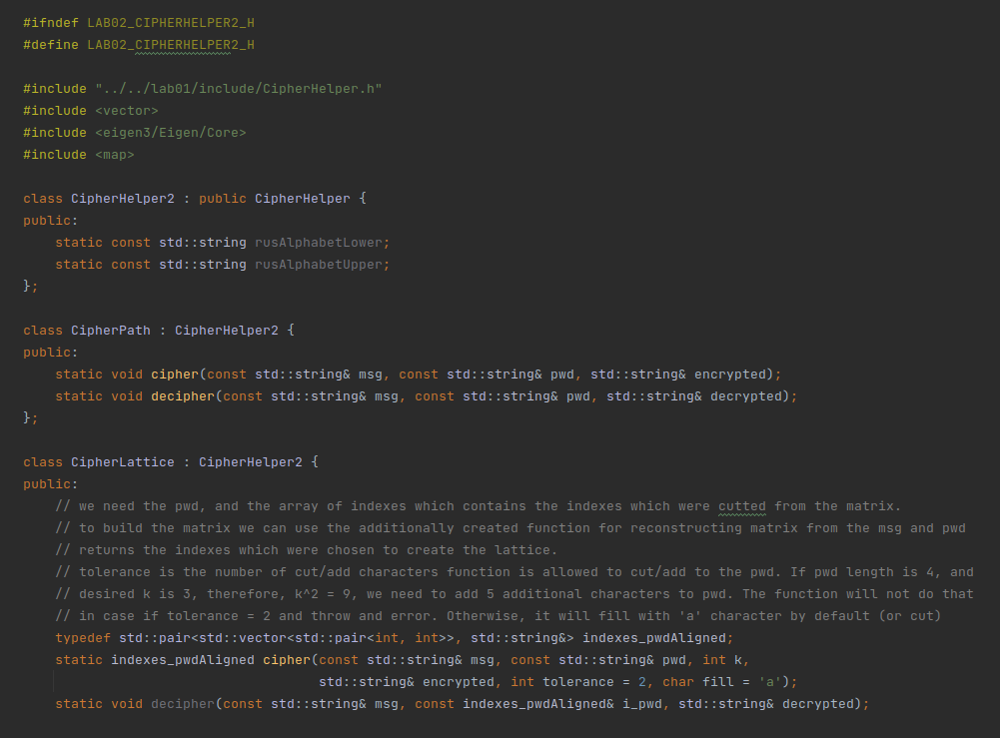{ #fig:008 width=70% }

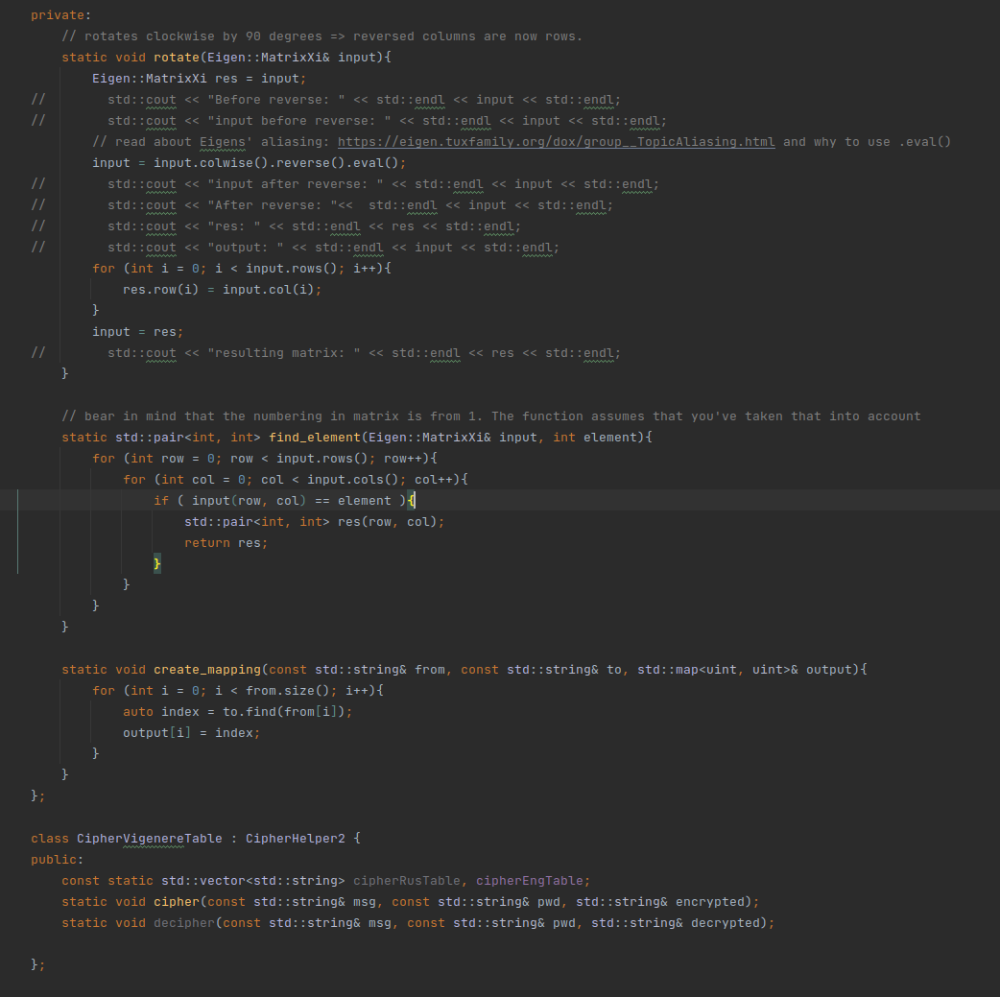{ #fig:009 width=70% }

Написал CMakeLists.txt файл, который создаёт библиотеку из класса CipherHelper2 и бинарник main, и прилинковывает библиотеку CipherHelper.

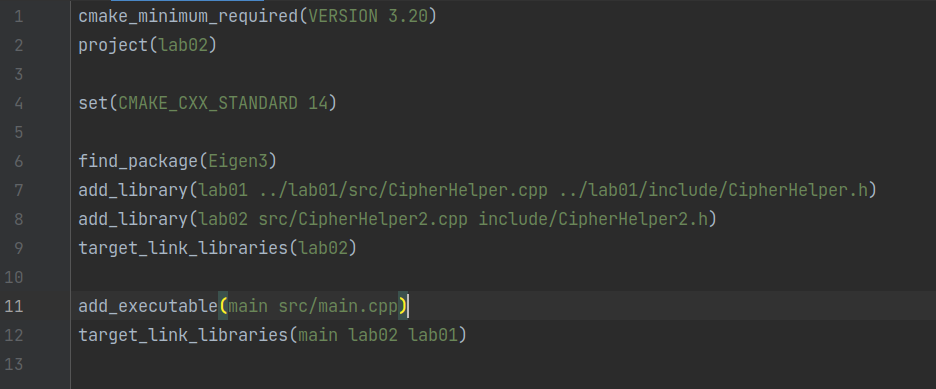{ #fig:010 width=70% }

Написал main.cpp файл, в котором есть тесты реализованных функций.

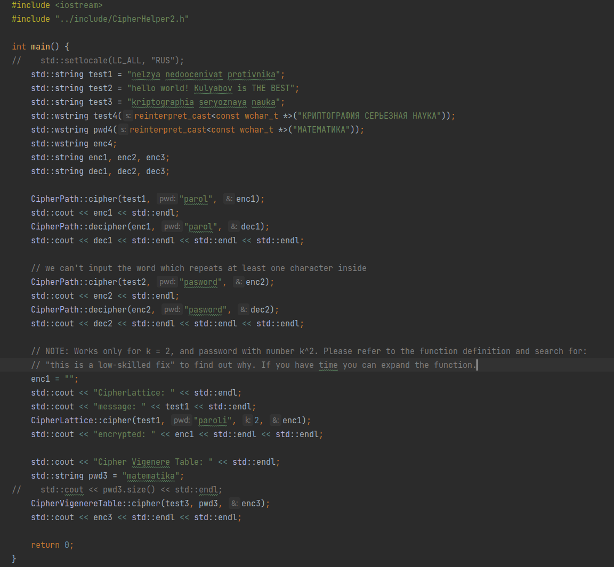{ #fig:011 width=70% }

Результаты тестов.

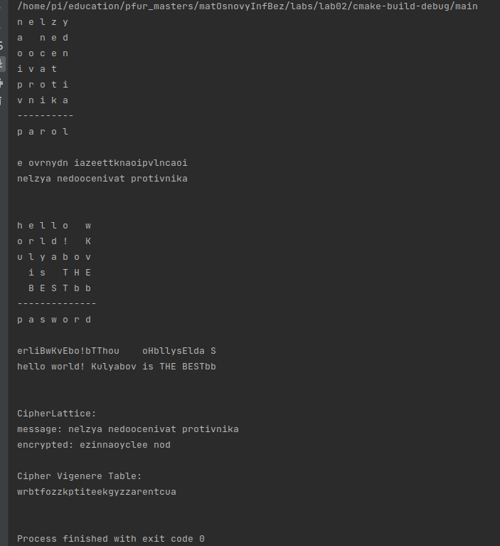{ #fig:012 width=70% }  

# Выводы

Освоил на практике применение методов маршрутного, решеточного, Виженера шифрований 
