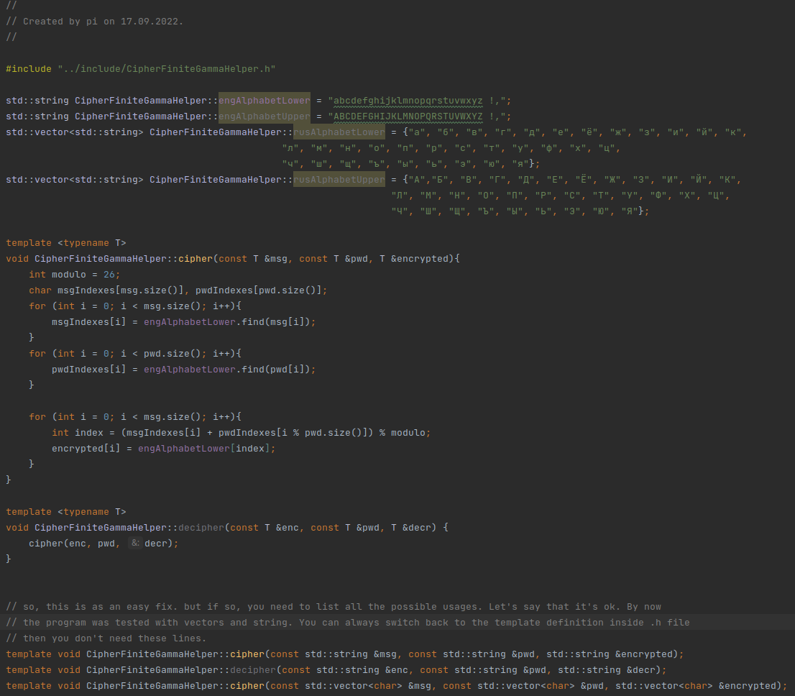
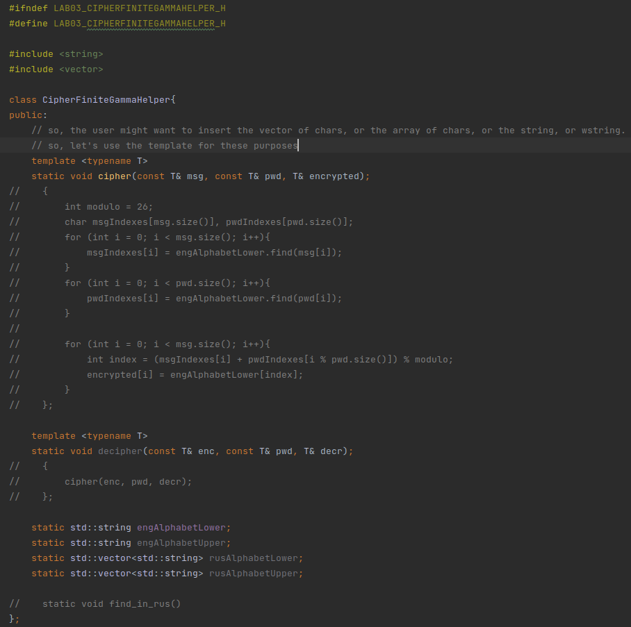
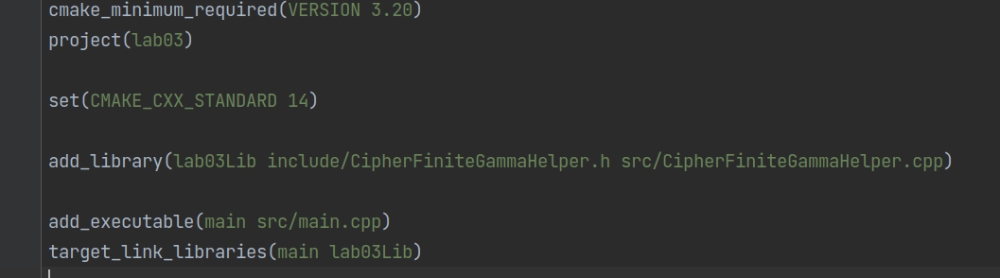
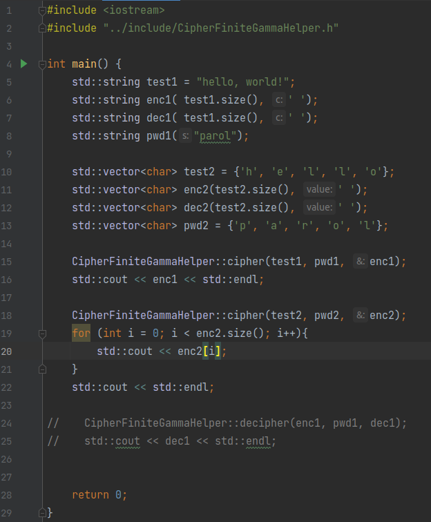
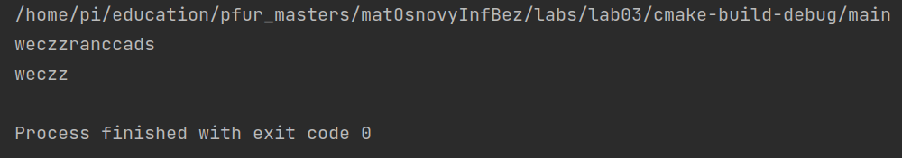

---
## Front matter
lang: ru-RU
title: Лабораторная работа №2
author: |
	Подмогильный Иван Александрович - студент группы НПМмд-02-22
date: 16.09.2022

## Formatting
toc: false
slide_level: 2
theme: metropolis
header-includes:
 - \metroset{progressbar=frametitle,sectionpage=progressbar,numbering=fraction}
 - '\makeatletter'
 - '\beamer@ignorenonframefalse'
 - '\makeatother'
aspectratio: 43
section-titles: true
---

# Шифрование гаммированием

## Прагматика выполнения

Умение пользоваться методами шифрование гаммированием

## Цель выполнения лабораторной работы

Освоить на практике использование методов шифрование гаммированием

## Задачи выполнения работы

Написать функции, которые реализуют шифрование гаммированием

## Результаты выполнения лабораторной работы.
Написал код для зашивровки кодов конечной гаммой. Тело функции:

{ #fig:001 width=70% }

## Заголовочный файл:

{ #fig:002 width=70% }

## Написал CMakeLists.txt файл.

{ #fig:003 width=70% }

## Написал main.cpp файл, в котором есть тесты реализованных функций.

{ #fig:004 width=70% }

## Результаты тестов.

{ #fig:005 width=70% }  

## Выводы

Освоил на практике применения метода шифрования гаммированием с конечной гаммой
