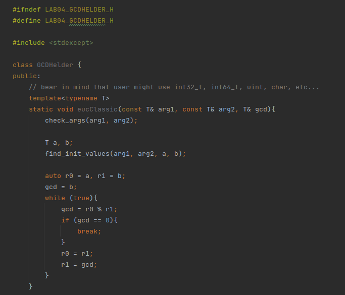
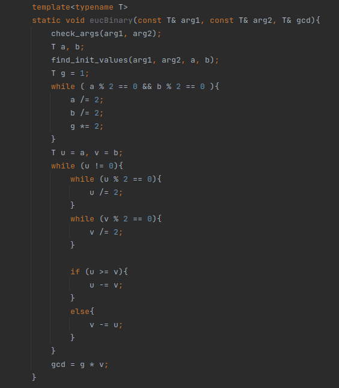
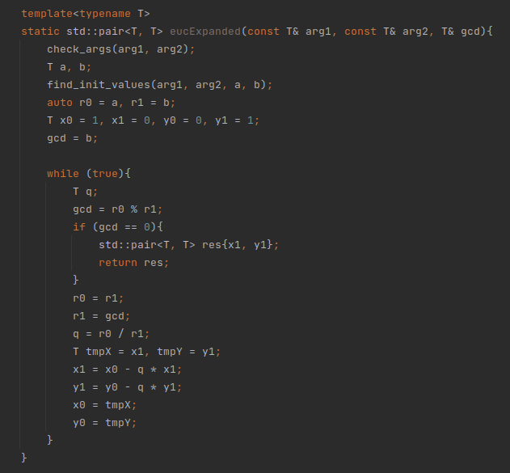
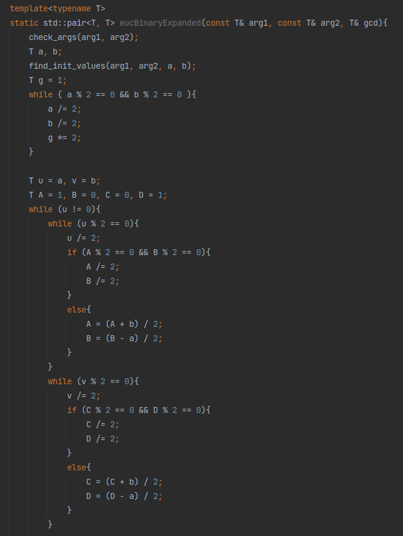
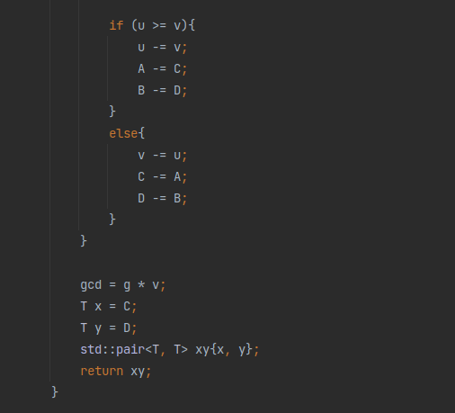
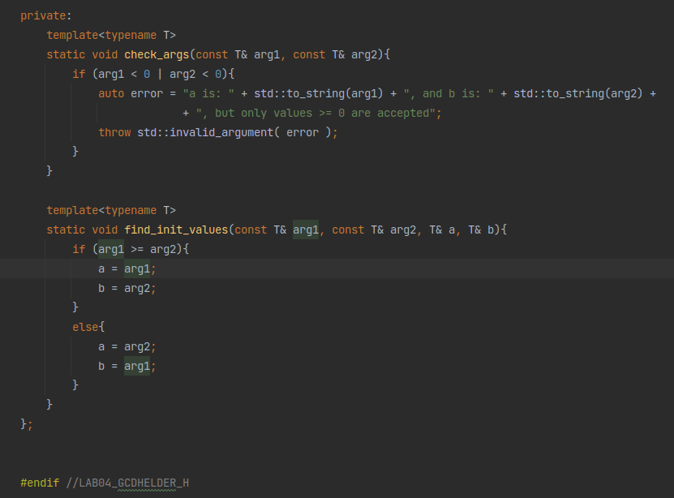
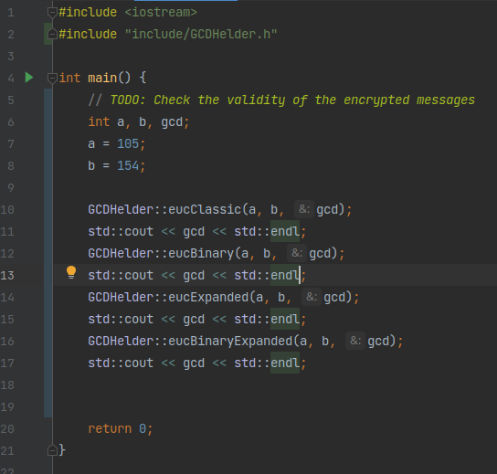
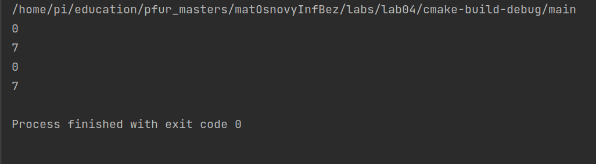

---
## Front matter
lang: ru-RU
title: Лабораторная работа №4
author: |
	Подмогильный Иван Александрович - студент группы НПМмд-02-22
date: 18.09.2022

## Formatting
toc: false
slide_level: 2
theme: metropolis
header-includes:
 - \metroset{progressbar=frametitle,sectionpage=progressbar,numbering=fraction}
 - '\makeatletter'
 - '\beamer@ignorenonframefalse'
 - '\makeatother'
aspectratio: 43
section-titles: true
---

# Вычисление наибольшего общего делителя

## Прагматика выполнения

Умение вычислять наибольшего делителя разными способами

## Цель выполнения лабораторной работы

Освоить на практике вычисление наибольшего делителя разными способами

## Задачи выполнения работы

1. Реализовать вычисление НОД алгоритмом Евклида
2. Реализовать вычисление НОД бинарным алгоритмом Евклида
3. Реализовать вычисление НОД расширенным алгоритмом Евклида
4. Реализовать вычисление НОД расширенным бинарным алгоритмом Евклида

## Результаты выполнения лабораторной работы.Написал код для вычисление НОД алгоритмом Евклида

{ #fig:001 width=70% }

## Реализовал вычисление НОД бинарным алгоритмом Евклида

{ #fig:002 width=70% }

## Реализовать вычисление НОД расширенным алгоритмом Евклида

{ #fig:003 width=70% }

## Реализовать вычисление НОД расширенным бинарным алгоритмом Евклида

{ #fig:004 width=70% }

## Часть 2

{ #fig:005 width=70% }

## Написал вспомогательные функции которые определены приватными.

{ #fig:006 width=70% }

## Написал main.cpp файл, в котором есть тесты реализованных функций.

{ #fig:007 width=70% }

## Результаты тестов.

{ #fig:008 width=70% }

## Выводы

Освоил на практике вычисление наибольшего делителя разными способами
