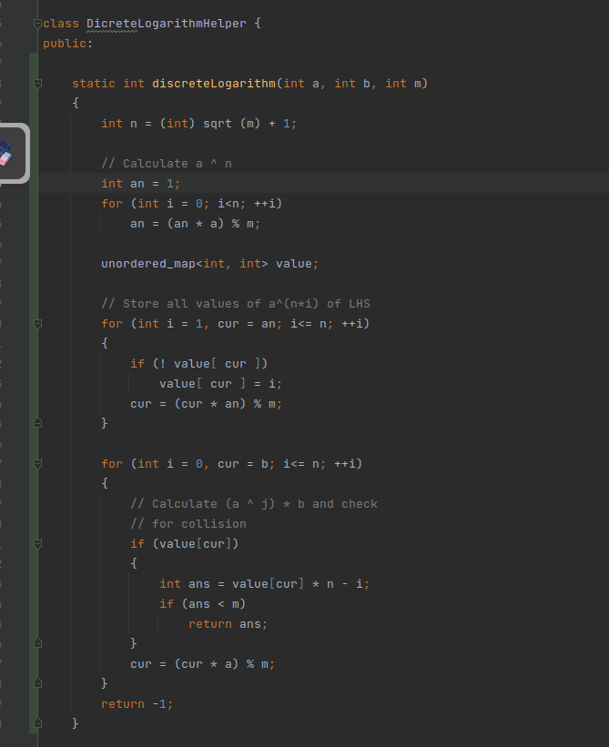
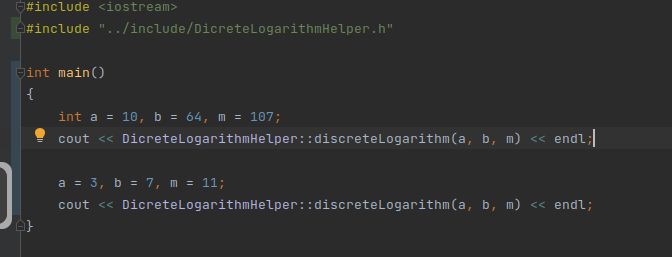
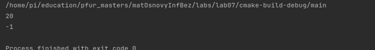

---
## Front matter
lang: ru-RU
title: Лабораторная работа №7
author: |
	Подмогильный Иван Александрович - студент группы НПМмд-02-22
date: 10.12.2022

## Formatting
toc: false
slide_level: 2
theme: metropolis
header-includes:
 - \metroset{progressbar=frametitle,sectionpage=progressbar,numbering=fraction}
 - '\makeatletter'
 - '\beamer@ignorenonframefalse'
 - '\makeatother'
aspectratio: 43
section-titles: true
---

# Вычисление дискретного логарифма

## Прагматика выполнения

Умение вычислять дискретный логарифм методом ро-Полларда

## Цель выполнения лабораторной работы

Освоить на практике вычисление дискретного логарифма методом ро-Полларда

## Задачи выполнения работы

1. Реализовать вычисление дискретного логарифма методом ро-Полларда

## Результаты. Написал код для вычисления дискретного логарифма

{ #fig:001 width=70% }

## Код для примеров

{ #fig:002 width=70% }

## Вывод примеров

{ #fig:003 width=70% }

# Выводы

Освоил на практике вычисление дискретного логарифма методов ро-Полларда
